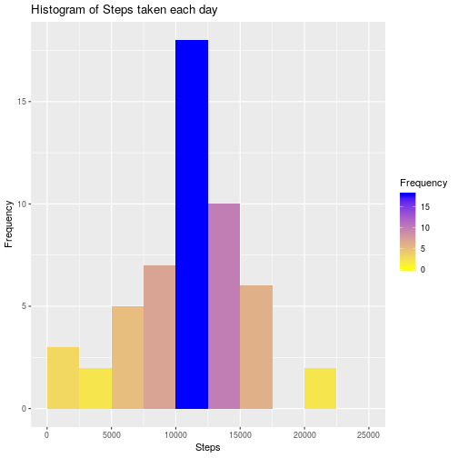
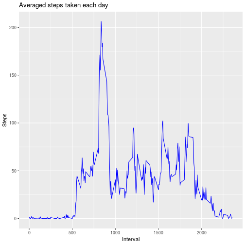
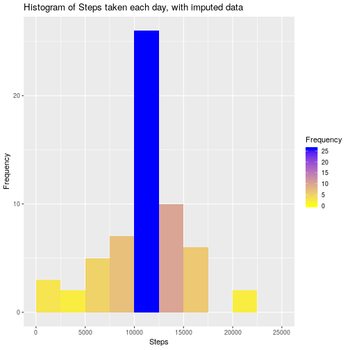
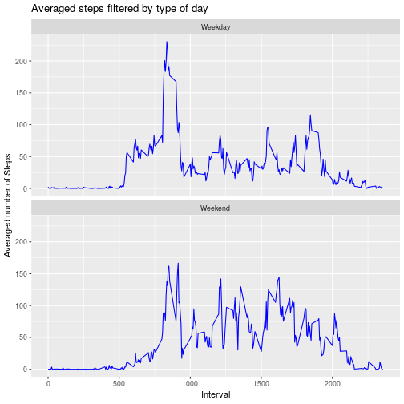

# REPRODUCIBLE RESEARCH - COURSE PROJECT 1

Loading and preprocessing the data
==================================

1. Reading the dataset and processing the data
----------------------------------------------

Loading the necessary packages


```r
library(ggplot2)
library(lubridate)
```

```
## 
## Attaching package: 'lubridate'
```

```
## The following object is masked from 'package:base':
## 
##     date
```

```r
library(plyr)
```

```
## 
## Attaching package: 'plyr'
```

```
## The following object is masked from 'package:lubridate':
## 
##     here
```

Reading the data from file *activity.csv*

```r
activityROH <- read.csv("activity.csv")
```

Renaming the names of the columns

```r
colnames(activityROH) <- c( "Steps", "Date", "Interval" )
```

Casting field date from string into a proper date one

```r
activityROH$Date <- ymd(activityROH$Date)
```

Keeping the data without NA's

```r
activityData <- activityROH[!is.na(activityROH$Steps),]
```

Checking structures and content of the provided data

```r
head(activityData)
```

```
##     Steps       Date Interval
## 289     0 2012-10-02        0
## 290     0 2012-10-02        5
## 291     0 2012-10-02       10
## 292     0 2012-10-02       15
## 293     0 2012-10-02       20
## 294     0 2012-10-02       25
```

```r
str(activityData)
```

```
## 'data.frame':	15264 obs. of  3 variables:
##  $ Steps   : int  0 0 0 0 0 0 0 0 0 0 ...
##  $ Date    : Date, format: "2012-10-02" "2012-10-02" ...
##  $ Interval: int  0 5 10 15 20 25 30 35 40 45 ...
```

```r
summary(activityData)
```

```
##      Steps             Date               Interval     
##  Min.   :  0.00   Min.   :2012-10-02   Min.   :   0.0  
##  1st Qu.:  0.00   1st Qu.:2012-10-16   1st Qu.: 588.8  
##  Median :  0.00   Median :2012-10-29   Median :1177.5  
##  Mean   : 37.38   Mean   :2012-10-30   Mean   :1177.5  
##  3rd Qu.: 12.00   3rd Qu.:2012-11-16   3rd Qu.:1766.2  
##  Max.   :806.00   Max.   :2012-11-29   Max.   :2355.0
```

What is mean total number of steps taken per day?
=================================================

2. Histogram of the total number of steps taken each day
--------------------------------------------------------

Summarizing the number of steps taken each day

```r
sumSteps = aggregate( activityData$Steps ~ activityData$Date, FUN=sum )
colnames( sumSteps ) <- c( 'Date', 'Steps' )
summary( sumSteps )
```

```
##       Date                Steps      
##  Min.   :2012-10-02   Min.   :   41  
##  1st Qu.:2012-10-16   1st Qu.: 8841  
##  Median :2012-10-29   Median :10765  
##  Mean   :2012-10-30   Mean   :10766  
##  3rd Qu.:2012-11-16   3rd Qu.:13294  
##  Max.   :2012-11-29   Max.   :21194
```

Creating the Histogram  of the total number of steps taken each day

```r
g <- ggplot(sumSteps, aes(x = Steps))
g +  geom_histogram(breaks=seq(0, 25000, by =2500), aes(fill = ..count..)) + labs(title = "Histogram of Steps taken each day", x = "Steps", y = "Frequency") + scale_fill_gradient("Frequency", low = "yellow", high = "blue")
```



3. Mean and median number of steps taken each day
-------------------------------------------------


```r
meanSteps     <- summary(sumSteps$Steps)[4]
medianSteps   <- summary(sumSteps$Steps)[3]
```

The Mean and Median number of steps taken each day are respective
10766.19
and
10765


Average daily activity pattern
==============================

4. Time series plot of the average number of steps taken
--------------------------------------------------------

As described in "What is the average daily activity pattern?":
*Make a time series plot (i.e. type = "l") of the 5-minute interval (x-axis) and the average number of steps taken, averaged across all days (y-axis)*

Averaging the number of steps taken

```r
aveSteps = ddply( activityData, .(Interval), summarize, AVG=mean(Steps) )
colnames( aveSteps ) <- c( 'Interval', 'Steps' )
summary( aveSteps )
```

```
##     Interval          Steps        
##  Min.   :   0.0   Min.   :  0.000  
##  1st Qu.: 588.8   1st Qu.:  2.486  
##  Median :1177.5   Median : 34.113  
##  Mean   :1177.5   Mean   : 37.383  
##  3rd Qu.:1766.2   3rd Qu.: 52.835  
##  Max.   :2355.0   Max.   :206.170
```

Plotting the data

```r
g <- ggplot(aveSteps, aes(x=Interval, y=Steps ))
g +  geom_line( color="blue" ) + labs( title="Averaged steps taken each day", x="Interval", y="Steps" )
```



5. The 5-minute interval that, on average, contains the maximum number of steps
-------------------------------------------------------------------------------

As described in "What is the average daily activity pattern?":
*Which 5-minute interval, on average across all the days in the dataset, contains the maximum number of steps?*

```r
maxAveSteps <- aveSteps[which.max(aveSteps$Steps),]
```
The maximal (averaged) number of steps by a 5 minute interval is 206.1698

Imputing missing values
=======================

6. Code to describe and show a strategy for imputing missing data

a. Calculate and report the total number of missing values in the dataset (i.e. the total number of rows with *NA*s)

```r
activityMiss  <- activityROH[is.na(activityROH$Steps),2:3]
missingValues <- nrow(activityMiss)
```
The amount of missing values is 2304

b. Devise a strategy for filling in all of the missing values in the dataset. The strategy does not need to be sophisticated. For example, you could use the mean/median for that day, or the mean for that 5-minute interval, etc.

Stragey: The *NA* Values will be replaced with the averaged amount of steps for the same interval.

c. Create a new dataset that is equal to the original dataset but with the missing data filled in.


```r
activityCook <- rbind( merge( activityMiss, aveSteps, by = c( "Interval" ) ), activityData )
summary(activityCook)
```

```
##     Interval           Date                Steps       
##  Min.   :   0.0   Min.   :2012-10-01   Min.   :  0.00  
##  1st Qu.: 588.8   1st Qu.:2012-10-16   1st Qu.:  0.00  
##  Median :1177.5   Median :2012-10-31   Median :  0.00  
##  Mean   :1177.5   Mean   :2012-10-31   Mean   : 37.38  
##  3rd Qu.:1766.2   3rd Qu.:2012-11-15   3rd Qu.: 27.00  
##  Max.   :2355.0   Max.   :2012-11-30   Max.   :806.00
```

7. Histogram of the total number of steps taken each day after missing values are imputed
-----------------------------------------------------------------------------------------

As described in "What is the average daily activity pattern?":
*Make a histogram of the total number of steps taken each day and Calculate and report the mean and median total number of steps taken per day. Do these values differ from the estimates from the first part of the assignment? What is the impact of imputing missing data on the estimates of the total daily number of steps?*

a. Histogram

Summarizing the number of steps taken each day

```r
imputedSumSteps = aggregate( activityCook$Steps ~ activityCook$Date, FUN=sum )
colnames( imputedSumSteps ) <- c( 'Date', 'Steps' )
summary( imputedSumSteps )
```

```
##       Date                Steps      
##  Min.   :2012-10-01   Min.   :   41  
##  1st Qu.:2012-10-16   1st Qu.: 9819  
##  Median :2012-10-31   Median :10766  
##  Mean   :2012-10-31   Mean   :10766  
##  3rd Qu.:2012-11-15   3rd Qu.:12811  
##  Max.   :2012-11-30   Max.   :21194
```

Creating the Histogram  of the total number of steps taken each day

```r
g <- ggplot(imputedSumSteps, aes(x = Steps))
g +  geom_histogram(breaks=seq(0, 25000, by =2500), aes(fill = ..count..)) + labs(title = "Histogram of Steps taken each day, with imputed data", x = "Steps", y = "Frequency") + scale_fill_gradient("Frequency", low = "yellow", high = "blue")
```



b. Mean and median values

Analizing the summary of both data sets

```r
# Data Set without imputed data
summary(sumSteps$Steps)
```

```
##    Min. 1st Qu.  Median    Mean 3rd Qu.    Max. 
##      41    8841   10765   10766   13294   21194
```

```r
# Data Set with imputed data
summary(imputedSumSteps$Steps)
```

```
##    Min. 1st Qu.  Median    Mean 3rd Qu.    Max. 
##      41    9819   10766   10766   12811   21194
```

cleary be recognized, that the Mean value does not changes, meanwhile the median increases in one step.
Then the influence of the imputed data is negligible.

Are there differences in activity patterns between weekdays and weekends?
=========================================================================

8. Panel plot comparing the average number of steps taken per 5-minute interval across weekdays and weekends
-------------------------------------------------

Categorizing measurement after day of the week

```r
aveImputed <- activityCook

aveImputed$WeekDay  <-         weekdays(aveImputed$Date)
aveImputed$Weektype <- ifelse( aveImputed$WeekDay %in% c( "Saturday", "Sunday", "Samstag", "Sonntag" ), "Weekend", "Weekday" )
summary(aveImputed)
```

```
##     Interval           Date                Steps          WeekDay         
##  Min.   :   0.0   Min.   :2012-10-01   Min.   :  0.00   Length:17568      
##  1st Qu.: 588.8   1st Qu.:2012-10-16   1st Qu.:  0.00   Class :character  
##  Median :1177.5   Median :2012-10-31   Median :  0.00   Mode  :character  
##  Mean   :1177.5   Mean   :2012-10-31   Mean   : 37.38                     
##  3rd Qu.:1766.2   3rd Qu.:2012-11-15   3rd Qu.: 27.00                     
##  Max.   :2355.0   Max.   :2012-11-30   Max.   :806.00                     
##    Weektype        
##  Length:17568      
##  Class :character  
##  Mode  :character  
##                    
##                    
## 
```

```r
aveImputed <- ddply( aveImputed, .(Interval,Weektype), summarize, AveragedSteps=mean(Steps) )

str(aveImputed)
```

```
## 'data.frame':	576 obs. of  3 variables:
##  $ Interval     : int  0 0 5 5 10 10 15 15 20 20 ...
##  $ Weektype     : chr  "Weekday" "Weekend" "Weekday" "Weekend" ...
##  $ AveragedSteps: num  2.2512 0.2146 0.4453 0.0425 0.1732 ...
```

```r
g <- ggplot(aveImputed, aes(x=Interval, y=AveragedSteps ))
g +  geom_line( color="blue" ) + labs( title="Averaged steps filtered by type of day", x="Interval", y="Averaged number of Steps" ) + facet_wrap(~Weektype, ncol = 1, nrow=2)
```



Clearly the activity pattern is very different on weekdays or weekends.
